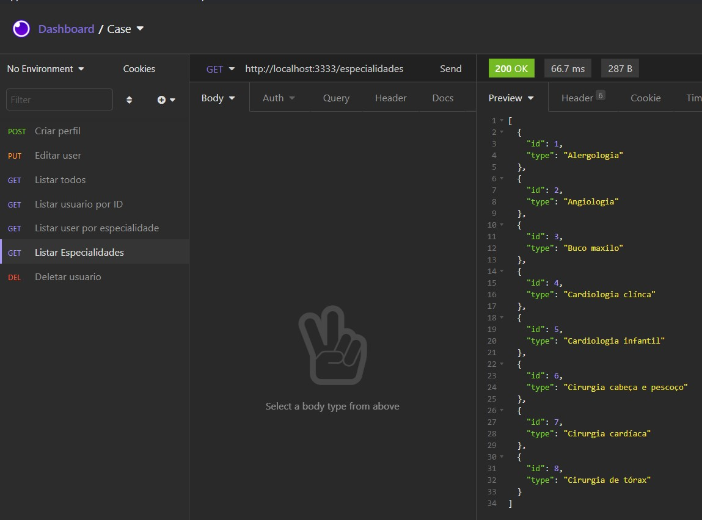
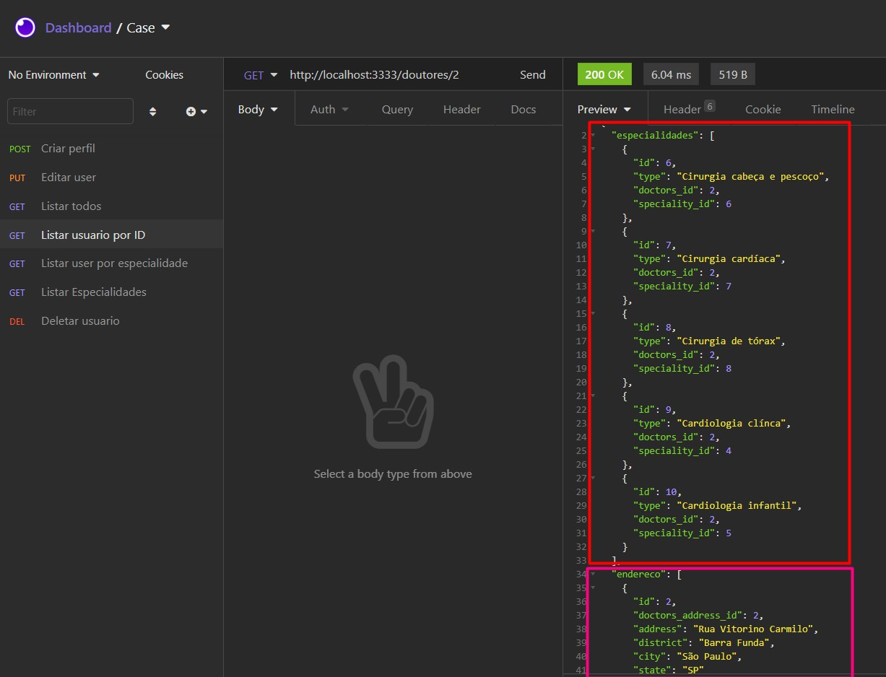
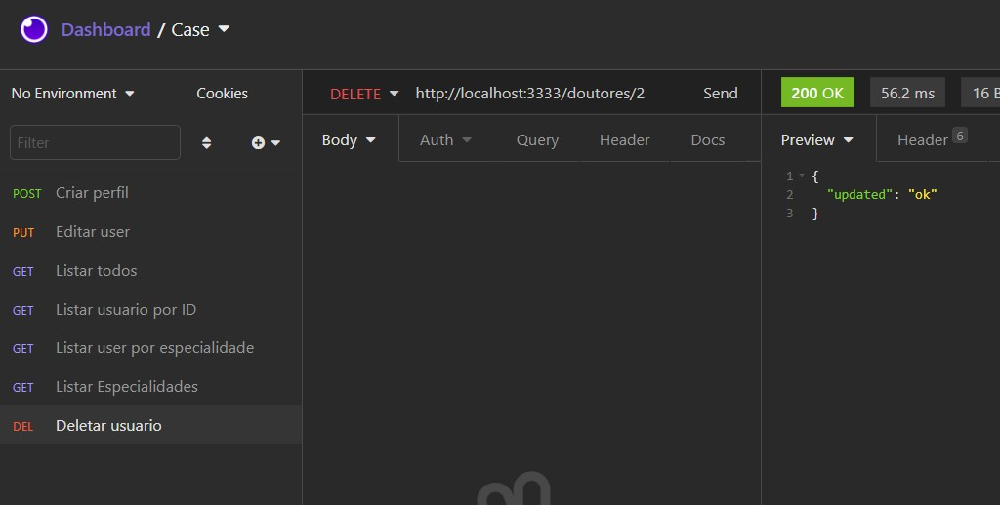
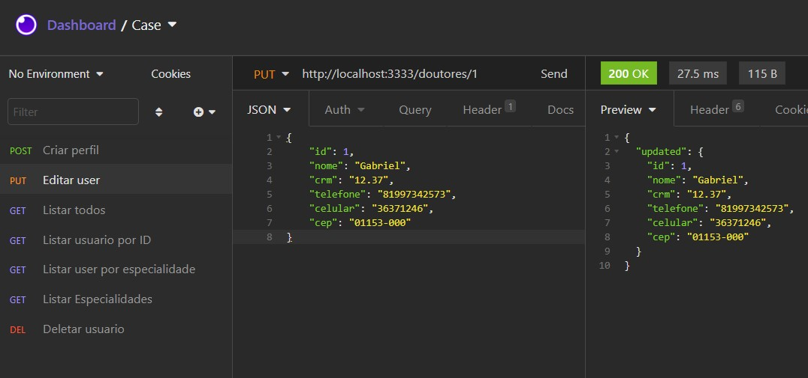

## :bulb: Sistema de Gerenciamento de Cadastros Médicos

Este projeto consite em uma API para cadastro de médicos.

Os usuário cadastrados podem ter:
 - Nome (até 120 caracteres);
 - CRM (com até 7 dígitos, caso digite menos são completados com 0 à frente);
 - Telefone;
 - Celular;
 - CEP ( O sistema consulta o CEP inserido e importa automaticamento todo o endereço).

 Operações:
 - [x] Cadastro de usuários
 - [x] Mínimo de duas especialidades
 - [x] Atualização de usuários
 - [x] Exclusão de usuários
 - [x] Busca do endereço através do CEP
 - [x] Busca de usuários por ID
 - [x] Busca de usuários pelas especialidades
 - [x] Busca de todos os usuários cadastrados na base.
 
 
 Já estão incluídas no sistema 8 possíveis especialidades:
  1. Alergologia
  2. Angiologia
  3. Buco maxilo
  4. Cardiologia Clínica
  5. Cardiologia Infantil
  6. Cirugia cabeça e pescoço
  7. Cirugia cardíaca
  8. Cirugia de Tórax


## 🚀 Tecnologias

Para o desenvolvimento desta API utilizou-se node.js, knex e o insomnia como plataforma de cadastro.

<code></code>
<code></code> 
<code></code>


### Blibiotecas que devem ser instaladas

```bash
npm install express
npm i --save-dev @types/express
npm i ts-node -D
npm i typescript -D
npx tsc --init #Cria o tsconfigjson
npm install knex
npm i sqlite3
npm install --save cep-promise
npm install node-cep-correios --save

```


## :information_source: Como executar?

```bash
#inicia a aplicação
npm run dev 

#Cria o banco de dados
npm run knex:migrate

#Inicializa o banco com as especialiades médicas pre-cadastradas
npm run knex:seed

```


## 🎨 Casos de testes

<p align="center">
 
 Listar todas especialidades médicas pré-cdastradas <br/>
  
 <br/>  <br/>
 
 
 Cria perfil <br/>
  
 <br/>  <br/>
 
 Lista todos perfis cadastrados<br/>
   <br/>  <br/>
 
 Buscar por usuário com ID específico<br/>
   <br/>  <br/>
 
 Buscar usuários com especialidade específica<br/>
   <br/>  <br/>
 
 Excluir usuário<br/>
   <br/>  <br/>
 
  Atualizar usuário<br/>
   <br/>  <br/>
 
 
</p>
