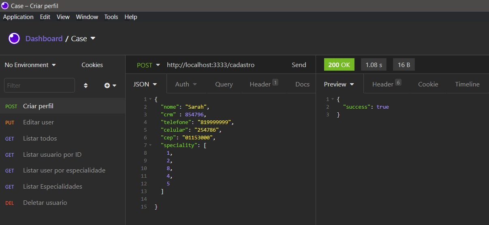
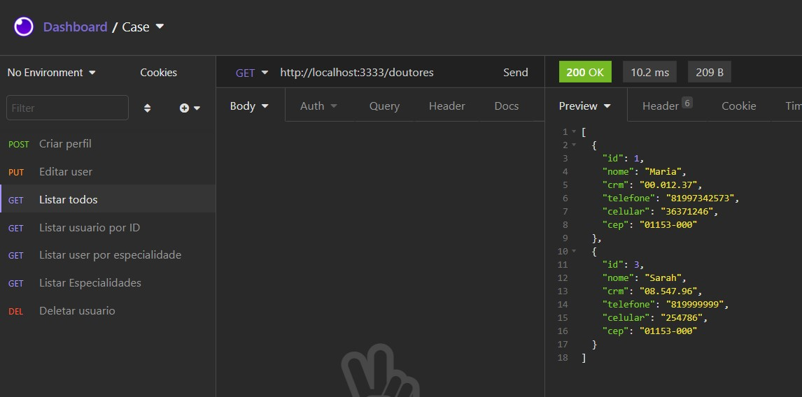

## :bulb: Gerenciamento médico

Este projeto consite em uma API para cadastro de médicos.
Os usuário cadastrados podem ter:
 - Nome (até 120 caracteres)
 - CRM (com até 7 dígitos, caso digite menos são completados com 0 à frente)
 - Telefone
 - Celular
 - Cep

 Operações:
 - [x] Cadastro de usuários
 - [x] Atualização de usuários
 - [x] Exclusão de usuários
 - [x] Busca do endereço através do CEP
 - [x] Busca de usuários por ID
 - [x] Busca de usuários pelas especialidades
 - [x] Busca de todos os usuários cadastrados na base.


## 🚀 Tecnologias

Para o desenvolvimento desta aPI utilizou-se node.js, knex e o insomnia para cadastro de testes.

<code></code>
<code></code> 


### Blibiotecas que deve ser instaladas

```bash
npm install express
npm i --save-dev @types/express
npm i ts-node -D
npm i typescript -D
npx tsc --init #Cria o tsconfigjson
npm install knex
npm i sqlite3
npm install --save cep-promise
npm install node-cep-correios --save

```


## :information_source: Como executar?

```bash
#inicia a aplicação
npm run dev 

#Cria o banco de dados
npm run knex:migrate

#Inicializa o banco com as especialiades médicas pre-cadastradas
npm run knex:seed

```


## 🎨 Casos de testes

<p align="center">
    Cria perfil<br/>  <br/>
   Lista todos perfis cadastrados<br/>  <br/>
</p>
